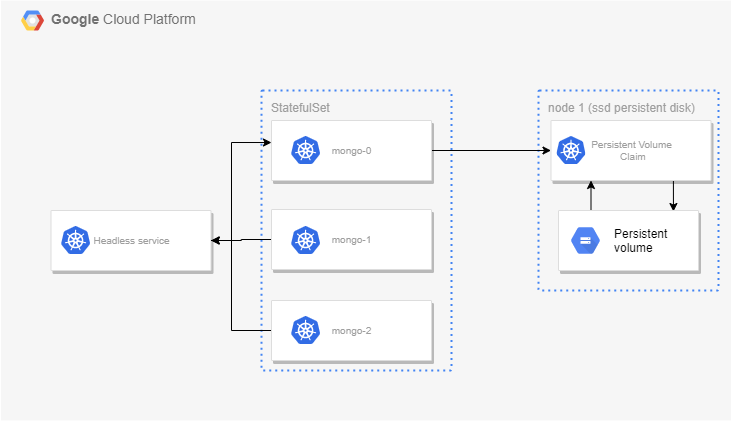

# statefulset-k8s-example



### Deploy SSD disk on K8s

```sh
kubectl apply -f google_cloud-ssd.yaml
```

```console
storageclass.storage.k8s.io/fast-disk created
```

### Deploy mongo statefulset

```
kubectl apply -f mongo-statefulset.yaml

kubectl get pods
```

To scale `statefulset`:

```sh
kubectl scale --replicas=4 statefulset mongo
```

### Delete `mongodb` services

Use [`kubectl delete`](https://kubernetes.io/docs/reference/generated/kubectl/kubectl-commands#delete)
to delete the services

```sh
kubectl delete statefulset mongo

kubectl delete svc mongo

kubectl delete pvc -l role=mongo
```

### References

1. https://github.com/cvallance/mongo-k8s-sidecar
2. [Running a MongoDB Database in Kubernetes with StatefulSets](https://google.qwiklabs.com/focuses/640?parent=catalog)

### Troubleshoot

1.
```console
$ kubectl apply -f mongo-statefulset.yaml

error: error validating "mongo-statefulset.yaml": error validating data: ValidationError(StatefulSet.spec.volumeClaimTemplates[0]): unknown field "annotations" in io.k8s.api.core.v1.PersistentVolumeClaim; if you choose to ignore these errors, turn validation off with --validate=false
```

reason: check for the syntax error

2. 
```console
$ kubectl apply -f mongo-statefulset.yaml

Forbidden: updates to statefulset spec for fields other than 'replicas', 'template', and 'updateStrategy' are forbidden
```
